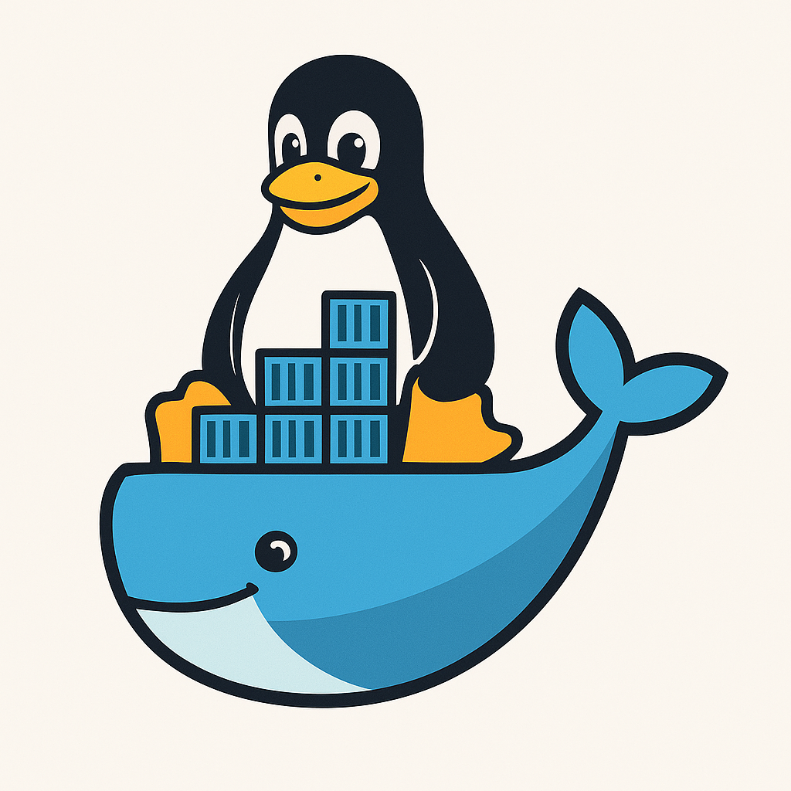

# WSL Docker-Style 🐳




## 🚀 Transforme seu WSL em um Sistema de Containers Docker

**Uma solução completa para criar, gerenciar e provisionar ambientes de desenvolvimento isolados no Windows 11 usando WSL2 - sem complexidade, com total controle!**

---

## 🎯 O Problema

Você já passou por isso?

- 🔥 **"Funcionava na minha máquina"** - versões conflitantes de linguagens e dependências
- 💣 **Quebrou tudo** - uma atualização quebrou todos os projetos
- 🤯 **Ambiente bagunçado** - Node.js 14, 16 e 18 instalados ao mesmo tempo
- ⏰ **Perda de tempo** - horas configurando ambiente para cada projeto
- 🔄 **Reinstalar tudo** - formatar o PC e perder todas as configurações

---

## ✨ A Solução: WSL Docker-Style

## Apresentando o WSL Manager 🚀

O **WSL Manager** é um script PowerShell chamado `wsl-manager.ps1` que transforma o WSL em uma ferramenta poderosa para gerenciar ambientes de desenvolvimento. Ele funciona como uma interface simples e intuitiva, permitindo criar, configurar e controlar instâncias WSL sem precisar entender comandos complexos do WSL — o script faz tudo para você!

### O que ele faz?

- Cria instâncias WSL baseadas em uma distribuição Linux (como `UbuntuMinimal2204`).
- Configura ambientes específicos (PHP, Node.js, Python, etc.) usando o script `provision-web-env.sh`.
- Gerencia essas instâncias com comandos fáceis, como listar, remover, fazer backup e mais.

### Principais Comandos

Aqui estão os comandos mais importantes do `wsl-manager.ps1` e exemplos de como usá-los:

- **create**: Cria uma nova instância WSL e provisiona o ambiente.
  ```powershell
  .\wsl-manager.ps1 -action create -name meu-projeto -base UbuntuMinimal2204 -envType node
  ```
  Isso cria uma instância chamada `meu-projeto` com um ambiente Node.js.

- **provision**: Configura ou atualiza o ambiente de uma instância existente.
  ```powershell
  .\wsl-manager.ps1 -action provision -name meu-projeto -envType php
  ```

- **list**: Lista todas as instâncias WSL registradas.
  ```powershell
  .\wsl-manager.ps1 -action list
  ```

- **remove**: Remove uma instância WSL.
  ```powershell
  .\wsl-manager.ps1 -action remove -name meu-projeto
  ```

- **exec**: Executa um comando dentro da instância como root.
  ```powershell
  .\wsl-manager.ps1 -action exec -name meu-projeto -command "npm install"
  ```

- **backup**: Faz backup de uma instância.
  ```powershell
  .\wsl-manager.ps1 -action backup -name meu-projeto
  ```

- **restore**: Restaura uma instância a partir de um backup.
  ```powershell
  .\wsl-manager.ps1 -action restore -name meu-projeto
  ```

- **monitor**: Monitora o uso de recursos das instâncias.
  ```powershell
  .\wsl-manager.ps1 -action monitor
  ```

- **stopall**: Para todas as instâncias em execução.
  ```powershell
  .\wsl-manager.ps1 -action stopall
  ```

- **help**: Mostra todos os comandos disponíveis.
  ```powershell
  .\wsl-manager.ps1 -action help
  ```

---

## O Papel do Script de Provisionamento 📋

O script `provision-web-env.sh` é chamado pelo `wsl-manager.ps1` para configurar o ambiente dentro da instância WSL. Ele instala as ferramentas e pacotes necessários com base no tipo de ambiente escolhido (ex.: PHP, Node.js, Python). Por exemplo:

- Para Node.js, ele já instala o NVM, Node.js LTS e Yarn. Poderia ser melhorado para incluir ferramentas como `create-react-app` e `create-next-app` para projetos React e Next.js.
- Para PHP, instala PHP 8.1, Nginx, MariaDB e Composer.

Esse script é flexível e pode ser adaptado para suportar mais tipos de ambientes conforme necessário.

---

## Como Usar o WSL Manager? ⚙️

### Instalação

1. Clone o repositório do GitHub:
   ```bash
   git clone https://github.com/theophiloweb/wsl-docker.git
   ```
2. Navegue até o diretório:
   ```bash
   cd wsl-docker
   ```
3. Execute o script para ver os comandos disponíveis:
   ```powershell
   .\wsl-manager.ps1 -action help
   ```

### Configuração

- Certifique-se de ter o WSL instalado no seu Windows.
- Tenha uma distribuição base (como `UbuntuMinimal2204`) pronta para criar novas instâncias.

Depois disso, é só usar os comandos para criar e gerenciar seus ambientes!

---

### 🏆 **Vantagens Principais**

#### 🔐 **Isolamento Total**
- Cada projeto em seu próprio "container" WSL
- Sem conflitos entre versões de linguagens
- Experimente livremente sem medo de quebrar o sistema

#### ⚡ **Rapidez e Eficiência**
```bash
# Criar um ambiente PHP completo em segundos
wsl-manager.ps1 -action create -name meu-projeto -envType php
```

#### 🎛️ **Gerenciamento Simples**
- **Criar** ambientes como containers Docker
- **Listar** todas as instâncias ativas
- **Remover** quando não precisar mais
- **Provisionar** com ferramentas específicas

#### 💰 **Economia de Recursos**
- Apenas 500MB-1GB por instância
- Sistema base compartilhado
- Inicie/pare conforme necessário

---

## 🛠️ **Ambientes Pré-Configurados**

### 🐘 **PHP Developer Kit**
```bash
✅ PHP 8.1 + Extensions
✅ Nginx Web Server  
✅ MariaDB Database
✅ Composer Package Manager
```

### 🟢 **Node.js Developer Kit**
```bash
✅ Node.js LTS via NVM
✅ NPM + Yarn
✅ Gerenciamento de versões
✅ Ferramentas de build
```

### 🐍 **Python Developer Kit**
```bash
✅ Python 3 + pip
✅ Virtual environments
✅ Pipenv para dependências
✅ Ferramentas de desenvolvimento
```

### ⚙️ **Base Developer Kit**
```bash
✅ Git + Build tools
✅ Curl + Wget
✅ Editores de texto
✅ Utilitários essenciais
```

---

## 🎮 **Como Funciona**

### 1️⃣ **Instalação Única**
```powershell
# Uma vez só - instalar e configurar
wsl --install
```

### 2️⃣ **Criar Ambientes**
```powershell
# Para cada projeto
wsl-manager.ps1 -action create -name projeto-loja-php -envType php
wsl-manager.ps1 -action create -name app-react -envType node
wsl-manager.ps1 -action create -name api-python -envType python
```

### 3️⃣ **Desenvolver**
```powershell
# Entrar no ambiente
wsl -d projeto-loja-php

# Ou executar comandos diretos
wsl-manager.ps1 -action exec -name app-react -command "npm start"
```

### 4️⃣ **Gerenciar**
```powershell
# Ver todos os ambientes
wsl-manager.ps1 -action list

# Remover quando não precisar
wsl-manager.ps1 -action remove -name projeto-antigo
```

---

## 📊 **Comparativo: Antes vs Depois**

| **Situação** | **❌ Antes** | **✅ Com WSL Docker-Style** |
|--------------|-------------|---------------------------|
| **Novo Projeto** | 2-4 horas configurando | 2-5 minutos criando ambiente |
| **Conflitos** | Versões brigando | Cada projeto isolado |
| **Limpeza** | Desinstalar manualmente | Um comando remove tudo |
| **Backup** | Impossível | Export/Import simples |
| **Experimentos** | Medo de quebrar | Ambiente descartável |
| **Colaboração** | "Funciona aqui" | Ambiente idêntico |

---

## 🎯 **Casos de Uso Reais**

### 👨‍💻 **Desenvolvedor Freelancer**
- **Projeto 1**: E-commerce PHP 7.4 + MySQL
- **Projeto 2**: API Node.js 16 + MongoDB  
- **Projeto 3**: Dashboard Python 3.9 + PostgreSQL
- **Cada um isolado, sem conflitos!**

### 🏢 **Estudante/Aprendiz**
- **Curso PHP**: Ambiente dedicado
- **Curso React**: Outro ambiente
- **Experimentos**: Ambientes descartáveis
- **Sem bagunçar o sistema principal!**

### 🔬 **Testes e Experimentos**
- **Nova versão do Node?** Crie um ambiente teste
- **Framework desconhecido?** Ambiente isolado
- **Deu errado?** Delete e refaça em minutos

---

## 🏃‍♂️ **Começar Agora**

### **Passo 1:** Executar
```powershell
# Instalar WSL
wsl --install
```

### **Passo 2:** Baixar Scripts
- 📥 Download da documentação completa
- 📝 Copiar os 2 scripts fornecidos
- ⚙️ Seguir o passo a passo

### **Passo 3:** Primeiro Ambiente
```powershell
# Criar seu primeiro ambiente
wsl-manager.ps1 -action create -name meu-primeiro-projeto -envType node
```

### **Passo 4:** Desenvolver!
```powershell
# Entrar no ambiente e começar a codar
wsl -d meu-primeiro-projeto
```

---

## 📋 **Requisitos Mínimos**

-  **Windows 11** (21H2+)
-  **4GB RAM** (8GB recomendado)
-  **10GB espaço livre**
-  **WSL 2 habilitado**

---

## 🎁 **Recursos Inclusos**

### 📚 **Documentação Completa**
- Guia passo a passo ilustrado
- Troubleshooting detalhado
- Comandos de referência rápida
- Melhores práticas

### 🔧 **Scripts Automatizados**
- **wsl-manager.ps1** - Gerenciador principal
- **provision-web-env.sh** - Provisionamento de ambientes
- Interface amigável com cores e feedback

### 🆘 **Suporte a Ambientes**
- PHP completo com Nginx/MySQL
- Node.js com NVM e Yarn
- Python com virtualenv
- Base customizável

---

## 🤝 **Contribuições e Suporte**

### 💬 **Precisa de Ajuda?**
- 📖 **Documentação completa** disponível
- 🐛 **Issues** no GitHub para bugs
- 💡 **Suggestions** para melhorias
- 📧 **Contato direto** para dúvidas urgentes

### 🔄 **Roadmap Futuro**
- [ ] Interface gráfica (GUI)
- [ ] Mais ambientes pré-configurados
- [ ] Backup/restore automatizado
- [ ] Monitoramento de recursos
- [ ] Templates personalizados

---
---

## 📞 **Contato & Links**

<div align="center">

### 👨‍💻 **Autor: Francisco das Chagas Teófilo da Silva**

[](https://www.linkedin.com/in/francisco-das-chagas-te%C3%B3filo-da-silva-15a12b2ab/)
[](https://github.com/theophiloweb)
[](mailto:teophilo@gmail.com)

---

**📧 Email:** teophilo@gmail.com  
**🔗 LinkedIn:** [(40) Francisco das Chagas Teófilo da Silva | LinkedIn](https://www.linkedin.com/in/francisco-das-chagas-te%C3%B3filo-da-silva-15a12b2ab/)  
**🐙 GitHub:** [theophiloweb (Francisco das Chagas Teófilo da Silva)](https://github.com/theophiloweb)

</div>

---

## 📄 **Licença**


Este projeto está sob a licença MIT. Veja o arquivo [LICENSE](LICENSE) para mais detalhes.

---

<div align="center">

### 🚀 **Pronto para Revolucionar seu Desenvolvimento?**

**⬇️ Baixe a documentação completa e comece agora mesmo! ⬇️**

[](#)

---

**⭐ Se este projeto te ajudou, deixe uma estrela no GitHub! ⭐**


</div>
